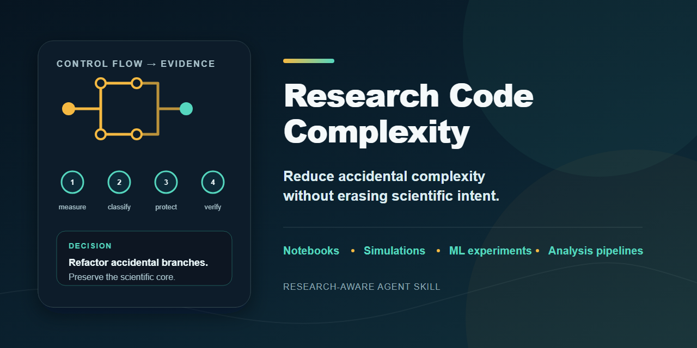

<!-- Substantially modified from saurabhkumar8112/cyclomatic-complexity-skill. See UPSTREAM.md. -->

# Research Code Complexity

**Reduce accidental complexity without erasing scientific intent.**

Research code is not simply messy production code: a high-complexity function may encode a published method, numerical kernel, experimental protocol, or frozen reproduction path. This portable Agent Skill measures cyclomatic complexity, classifies the scientific role and risk of each hotspot, and then recommends refactoring, characterization, documentation, wrapping, deferral, exclusion, or leaving the code unchanged.

[](https://github.com/kaushika05/research-code-complexity-skill/releases/tag/v0.1.0)
[](LICENSE)

```text
/plugin marketplace add kaushika05/research-code-complexity-skill
/plugin install research-code-complexity@research-code-complexity-skill
```

> “Audit the complexity in `src/run_experiments.py`. Protect split IDs and seed behavior; do not edit.”

The report names the analyzer and version, resolves any research profile, identifies the scientific contract, ranks per-function hotspots, and records evidence for each decision. A high score is a triage signal—not an automatic command to split a function.



## Why research code needs a different decision model

Ordinary maintainability rules often assume branches are implementation choices. In research repositories, some branches are the method: inclusion criteria, physical boundary conditions, reference-algorithm steps, solver behavior, statistical procedures, or protocol decisions. Lowering their complexity number can break paper traceability or alter numerical and stochastic behavior.

The skill distinguishes:

- **Essential scientific complexity:** inherent to the model, experiment, analysis, protocol, equation, or literal reference implementation. The safer outcome may be documentation, characterization, a wrapper, or **Leave as-is**.
- **Accidental implementation complexity:** nested orchestration, repeated validation, hidden state, Boolean flag combinations, embedded configuration, mixed I/O/modeling/analysis/presentation, and repeated path/seed/split handling. This is the primary refactoring target.

It reports cyclomatic complexity separately from scientific risk, verification strength, nesting, hidden state, and other secondary observations. It never produces a pseudo-precise research-quality score.

## Modes

| Mode | Behavior | Repository edits |
|---|---|---|
| Audit | Measure, classify, identify contracts and risks, recommend | None |
| Plan | Audit plus an ordered plan and verification requirements | None unless separately requested |
| Refactor | Baseline, incremental edits, verification, re-measurement | Only after an explicit change request |

Automatic triggering never grants Refactor mode. Full-repository scans occur only when explicitly requested; otherwise the skill stays within the named diff, files, functions, cells, or subsystem.

## What it measures

Cyclomatic complexity is the primary quantitative metric, measured per function or equivalent executable unit with repository-configured analyzers when available. The skill records the analyzer, version, command, exclusions, threshold, and counting variant. It does not compare values from different analyzers as though their handling of Boolean operators, pattern matching, exceptions, comprehensions, or language constructs were identical.

The measurement guide covers Python, R, JavaScript/TypeScript, Go, C/C++, Rust, Java, Julia, MATLAB, Fortran, Shell, and Jupyter notebooks. Where dependable tooling is unavailable or unsuitable, the skill uses a transparent manual or parser-assisted count and says exactly what counted. Notebook review separates functions defined in cells, top-level cell flow, and hidden execution-order state.

See [the verified tool matrix](skills/research-code-complexity/references/measurement-tools.md).

## Scientific contract and verification

Before changing a scientific hotspot, the skill seeks the applicable inputs, outputs, schemas, units, dtypes, precision, devices, operation order, missing-value behavior, dataset and split identities, RNG and seeds, preprocessing fit boundaries, solver settings, checkpoints, invariants, performance envelopes, and manuscript/equation/figure/protocol mappings.

Verification is matched to the artifact:

- Exact comparisons for deterministic values, schemas, row/sample IDs, serialization, CLI behavior, and stable files.
- Evidence-sourced tolerances plus invariant checks for floating-point work; tolerances are never invented to make a test pass.
- Fixed-seed characterization and, when feasible, multi-seed metrics or distributions for stochastic work.
- Formula, coding, grouping, weighting, missingness, correction, estimate, interval, and sample-size checks for statistics. `p > 0.05` is never treated as equivalence.
- Split/leakage, preprocessing, seed, metric, checkpoint, evaluation-mode, device, and precision checks for ML.
- Restart-and-run-all plus source-data checks for notebooks, figures, and tables when the environment permits.

Unavailable data, software, hardware, credentials, full retraining, or reproduction runs are reported as limitations rather than silently replaced by weaker claims.

## Two contrasting examples

### A. Refactor accidental experiment-runner complexity

Before, one high-CC runner validates flags, selects datasets, normalizes data, launches models, evaluates checkpoints, and writes outputs. The scientific transformations are entangled with orchestration.

The skill first freezes split IDs, seed derivation, preprocessing boundaries, output schema, and checkpoint contract. It can then extract domain-named operations and explicit configuration, re-run the same analyzer, compare exact identities and fixed-seed outputs, and report before/after evidence.

### B. Leave a literal kernel unchanged

A solver function has high CC because its branches mirror Equation 7 and published boundary conditions. Rewriting it into dispatch tables would lower the number but weaken literal correspondence and might change operation ordering.

The skill can decide **Leave as-is**, add or recommend an equation mapping and characterization tests, and place a cleaner adapter around the kernel. High CC remains visible and justified rather than hidden.

## Configuration

Profiles make the behavior reusable without hard-coding a discipline or user persona:

1. Explicit current request (highest precedence)
2. `.research-code-complexity.local.yaml`
3. `.research-code-complexity.yaml`
4. `~/.config/research-code-complexity/config.yaml`
5. Repository evidence and conservative inference

Start with the [shared template](skills/research-code-complexity/assets/research-code-complexity.example.yaml) or [local override template](skills/research-code-complexity/assets/research-code-complexity.local.example.yaml). The local file is ignored by this repository pattern and should normally stay uncommitted.

Validate a profile in an isolated development environment:

```bash
python -m venv .venv
# Windows: .venv\Scripts\python -m pip install -r requirements-dev.txt
# POSIX:   .venv/bin/python -m pip install -r requirements-dev.txt
python skills/research-code-complexity/scripts/validate_profile.py .research-code-complexity.yaml
```

The JSON Schema rejects ordinary unknown keys with field paths and accepts explicit `x-...` extensions. Only `schema_version` is universally required. Generic templates leave tolerances, equivalence margins, lifecycle, and reproduction commands null or omitted until project evidence supplies them.

Examples cover [machine learning](examples/profiles/machine-learning.yaml), [numerical simulation](examples/profiles/numerical-simulation.yaml), [behavioral research](examples/profiles/behavioral-study.yaml), and [bioinformatics](examples/profiles/bioinformatics.yaml).

## Supported artifacts

The role model includes exploratory notebooks/scripts, ingestion, cleaning/preprocessing, orchestration, analysis/statistics, figure generation, scientific and numerical kernels, simulations, reference implementations, reusable libraries, infrastructure, tests, manuscript-linked reproduction, published/archived snapshots, generated and vendored code, raw data, and derived outputs.

Generated, vendored, and raw artifacts are excluded by default. Raw data is never modified during complexity refactoring. Canonical published snapshots are frozen unless the user explicitly authorizes a new version.

## Installation and use

### Claude Code marketplace

Inside Claude Code:

```text
/plugin marketplace add kaushika05/research-code-complexity-skill
/plugin install research-code-complexity@research-code-complexity-skill
```

Invoke it directly with `/research-code-complexity:research-code-complexity`, or describe a scoped scientific-code complexity task and let Claude select it.

### Other Agent Skills-compatible clients

Install or copy the `skills/research-code-complexity` directory using the client's documented skill-discovery mechanism. The core `SKILL.md` uses only portable Agent Skills frontmatter and relative resources; Claude-specific plugin manifests remain outside the skill directory. Client installation paths and activation behavior vary, so consult that client's current documentation.

The release includes an ordinary ZIP of the complete skill directory and a SHA-256 checksum. No `.skill` extension is used because the current open Agent Skills specification defines a directory, not a normative archive format.

## Limitations

- Cyclomatic-complexity tools differ; cross-tool scores are not interchangeable.
- Static analysis cannot establish scientific correctness, reproducibility, or semantic equivalence.
- Domain overlays are prompts for contract discovery, not expert review.
- Notebook execution, proprietary MATLAB analysis, full experiments, restricted data, GPUs, or HPC systems may be unavailable in a given environment.
- Julia complexity tooling is comparatively young; parser limitations and version information must be reported.
- v0.1.0 ships eval definitions and selected local comparisons, not paid model evals in CI.

## Development, citation, and attribution

See [CONTRIBUTING.md](CONTRIBUTING.md) for development and validation commands, [DESIGN.md](DESIGN.md) for evidence-backed design choices, and [CITATION.cff](CITATION.cff) for citation metadata.

This project is a substantial fork of Saurabh Kumar's [`cyclomatic-complexity-skill`](https://github.com/saurabhkumar8112/cyclomatic-complexity-skill), used under Apache-2.0. It retains the measure-first, real-analyzer, incremental-refactor, re-measure, evidence-reporting, and anti-metric-gaming core. Saurabh Kumar has not endorsed this fork. Exact provenance and modifications are recorded in [UPSTREAM.md](UPSTREAM.md).

Licensed under [Apache-2.0](LICENSE).
